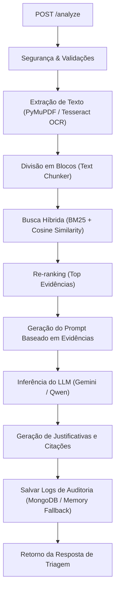

# Analisador de Currículos com IA

## Introdução
Esta API foi desenvolvida para otimizar a triagem de currículos por meio de Inteligência Artificial.
A aplicação recebe múltiplos currículos (PDF/JPEG/PNG), extrai seus textos nativamente ou via OCR,
gera resumos estruturados e responde a perguntas de recrutamento com rankings de relevância.
Os resultados contam com score de aderência, justificativas claras baseadas em dados e citações diretas.
Para garantir privacidade e velocidade, todo o fluxo de arquivos e vetores é processado em memória,
mantendo registros de auditoria salvos no MongoDB com resiliência local.

### Interface do Sistema


## Instruções de Build
Para construir a imagem Docker da aplicação e suas dependências a partir do código-fonte, certifique-se de ter o Docker e Docker Compose instalados e execute:

```bash
docker compose build
```

Isso compilará o ambiente do FastAPI, baixará o modelo de LLM local padrão (Qwen2.5) e instalará os pacotes necessários, incluindo o suporte a OCR via Tesseract.

## Execução

### 1. Configuração do ambiente (.env)
Antes de iniciar a aplicação, crie um arquivo `.env` na raiz do projeto conforme o modelo abaixo:

```env
MONGO_URI=mongodb://mongodb:27017
MONGO_DB=resume-analyzer
USE_LOCAL_LLM=true
GEMINI_API_KEY=sua_chave_de_api_do_gemini_aqui
GEMINI_MODEL=gemini-2.5-flash
LOG_LEVEL=INFO
```
*(A chave `GEMINI_API_KEY` é opcional. Se não for preenchida, o sistema utilizará apenas o modelo Qwen local).*

### 2. Executando com Docker Compose
Para iniciar a API e a instância resiliente do MongoDB:

```bash
docker compose up -d
```

A aplicação ficará disponível em:
- Frontend: `http://localhost:8000` (ou `/en` para inglês)
- Swagger UI (Documentação da API): `http://localhost:8000/docs`
- Métricas Prometheus: `http://localhost:8000/metrics`

### 3. Executando localmente para desenvolvimento
Caso deseje rodar a API diretamente no host macOS (fora do container):
```bash
.venv/bin/pip install -r requirements.txt
MONGO_URI=mongodb://localhost:27017 MONGO_DB=resume-analyzer uvicorn app.main:app --reload --host 0.0.0.0 --port 8001
```

### 4. Executando os testes de qualidade
Para garantir o bom funcionamento do OCR, dos serviços de LLM e da rota principal:
```bash
.venv/bin/pytest
```

## Limites

Abaixo estão detalhados os limites e decisões do projeto (incluindo modelos, tipos de busca suportados, processos de OCR e RAG, e parâmetros de geração):

| Categoria | Decisão / Limite / Parâmetro | Detalhe | Justificativa / Impacto |
| :--- | :--- | :--- | :--- |
| **Tipos de Modelos** | Qwen2.5-0.5B-Instruct (Local)<br>Gemini 2.5 Flash (Online) | Local: GGUF via `llama-cpp-python`<br>Online: REST API com `thinkingBudget: 0` | Qwen2.5 garante privacidade offline e baixo consumo de CPU local.<br>Gemini 2.5 Flash oferece máxima velocidade e inteligência integrada com zero pensamento de rascunho. |
| **Temperatura do LLM** | `temperature = 0.1` | Baixa temperatura (próxima de 0) | Garante comportamento determinístico, reduz alucinações nas justificativas e foca estritamente nos dados extraídos dos currículos. |
| **Tipo de Perguntas Suportadas** | Busca Híbrida: Léxica (BM25) + Semântica (Embeddings) + Combinação | BM25 para correspondência exata de termos/tecnologias.<br>Embeddings para similaridade semântica em memória.<br>Score Final: `0.7 * Semântico + 0.3 * Léxico` | Permite responder tanto perguntas diretas por palavras-chave/tecnologias quanto perguntas abstratas por perfil ou senioridade. |
| **Tipo de Processos** | Pipeline em Memória & OCR Automático | PyMuPDF (PDFs nativos) + Tesseract OCR (Imagens/Scans) com fallback em tons de cinza. | Garante extração de dados de qualquer currículo sem salvar arquivos em disco, preservando a privacidade. |
| **Parâmetros de RAG** | Chunk Size e Overlap | Chunks de 500 caracteres, Overlap de 50 caracteres | Limita o tamanho do texto enviado ao prompt para evitar estouro da janela de contexto da LLM local. |
| **Limites de Entrada** | Quantidade e tamanho dos arquivos | Máximo de 10 arquivos por requisição, até 10 MB por arquivo e até 15 páginas. | Evita estouro de memória no servidor e sobrecarga de processamento por requisição concorrente. |
| **Auditoria e Logs** | Metadados persistidos sem arquivos | Logs salvos no MongoDB (com fallback automático em memória se o banco estiver fora do ar). | Garante conformidade com o desafio técnico sem armazenar os PDFs dos candidatos. |

## Arquitetura

### 1. Diagrama de Fluxo
A arquitetura do RAG em memória opera de acordo com a sequência ilustrada no diagrama abaixo:



### 2. Visão Geral da Arquitetura
O sistema segue os princípios de Clean Architecture e SOLID, estruturado em:
- [app/api](file:///Users/leandro/Desktop/teddy/app/api): Define as rotas HTTP e documentação (Swagger).
- [app/core](file:///Users/leandro/Desktop/teddy/app/core): Configurações de ambiente, segurança e controle de exceções da aplicação.
- [app/repositories](file:///Users/leandro/Desktop/teddy/app/repositories): Gerenciador de logs do MongoDB e cache resiliente.
- [app/services](file:///Users/leandro/Desktop/teddy/app/services): OCR robusto com Tesseract, analisador de currículos, busca híbrida em memória e sumarização/sintetização com LLMs.
- [app/rag](file:///Users/leandro/Desktop/teddy/app/rag): Módulo de chunking estruturado e views semânticas.

### 3. Escalabilidade para Produção
Embora o desenho atual priorize processamento puramente em memória (sem persistir vetores ou arquivos) para garantir a privacidade, a arquitetura foi modularizada para evoluir facilmente em produção:
* **Workers de Processamento**: Separação das tarefas pesadas de OCR em filas assíncronas (ex: Celery + Redis).
* **Banco de Vetores Dedicado**: Transição da similaridade cossena em memória para um banco de vetores dedicado (ex: Qdrant ou Pgvector) se a persistência de longo prazo for desejada.
* **APIs Distribuídas**: Escalabilidade horizontal do contêiner da API FastAPI por trás de um balanceador de carga.
